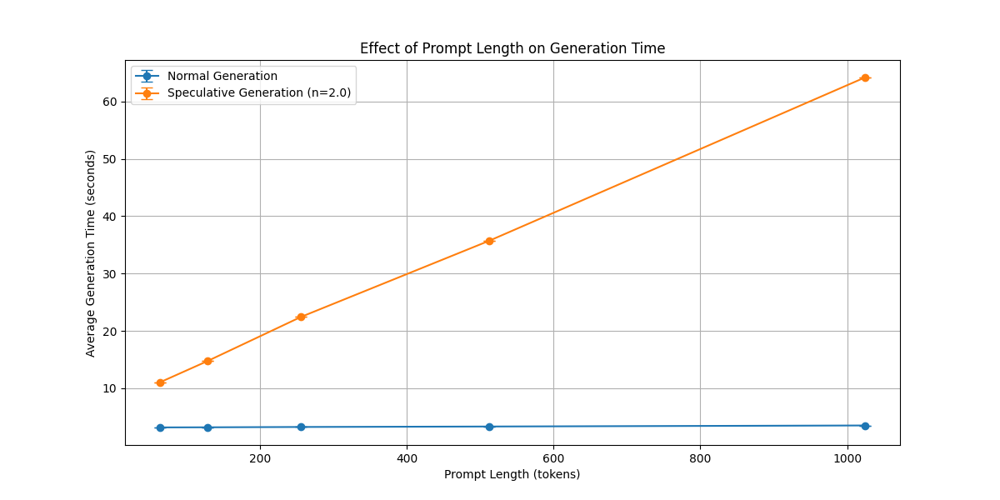
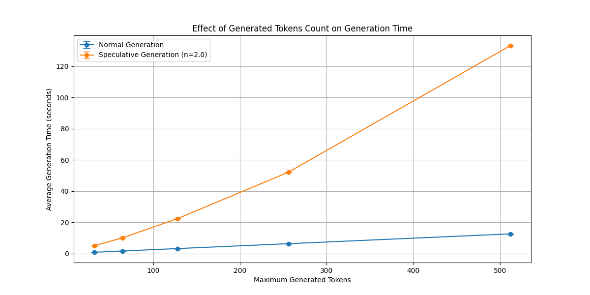
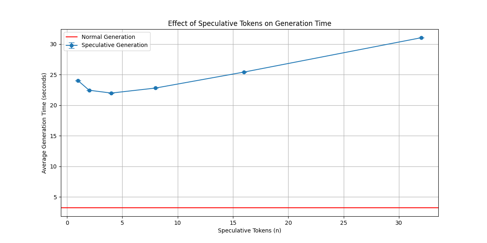
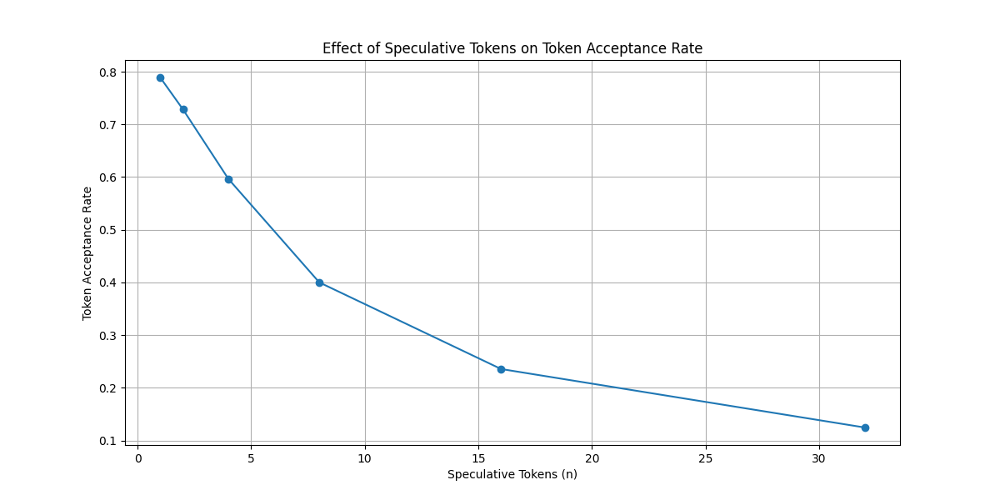
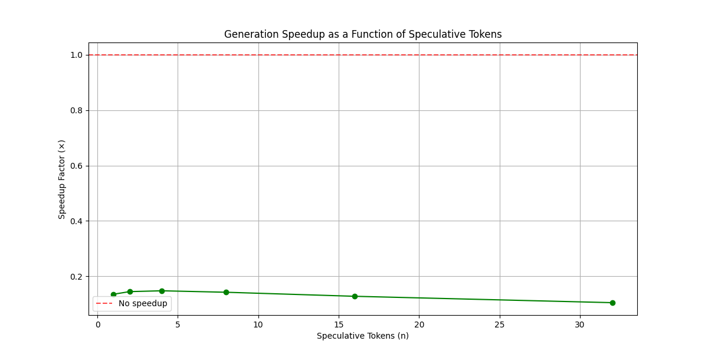

# Speculative Decoding

1. Using a smaller "draft" model to quickly predict N potential tokens
2. Verifying these predictions using the larger "target" model
3. Accepting all correct predictions and rejecting+regenerating when a mismatch occurs


## Project Structure

- `spec_dec.py` - Core implementation of speculative decoding algorithm and normal generation functions
- `experiments_func.py` - Functions to run experiments with different parameters and measure performance
- `main.py` - Entry point for running all experiments with configurable model options
- `requirements.txt` - List of Python dependencies required for the project
- `exp_results/` - Directory containing experimental results:
  - `experiment_results.csv` - Raw data from experiments in CSV format
  - `prompt_length_effect.png` - Graph showing effect of prompt length
  - `max_tokens_effect.png` - Graph showing effect of maximum generated tokens
  - `n_effect.png` - Graph showing effect of N parameter (speculative tokens)
  - `acceptance_rate.png` - Graph showing token acceptance rate vs. N
  - `speedup.png` - Graph showing speedup factor vs. N

## Usage

Run experiments using the default models:

## How to Run

With default models:
```bash
python main.py
```

With your own models:
```bash
python main.py --big_model "model1" --small_model "model2" --output "results.csv"
```

### Options

- `--big_model`: Big model (default: "unsloth/Llama-3.2-3B-Instruct")
- `--small_model`: Small model (default: "unsloth/Llama-3.2-1B-Instruct")
- `--output`: Results file (default: "experiment_results.csv")

## Experiments

The experiments conducted in this project evaluate speculative decoding across three dimensions:

1. **Prompt Length**: How different prompt sizes affect performance
2. **Maximum Tokens**: Effect of varying the number of tokens to generate
3. **Speculation Depth**: Effect of varying N (number of speculative tokens)

For each experiment measure:
- Generation time
- Acceptance rate of speculative tokens
- Speedup compared to standard generation

## Results

### Prompt Length Effect



### Generation Length Effect



### N Parameter Effect



### Token Acceptance Rate



### Speedup


